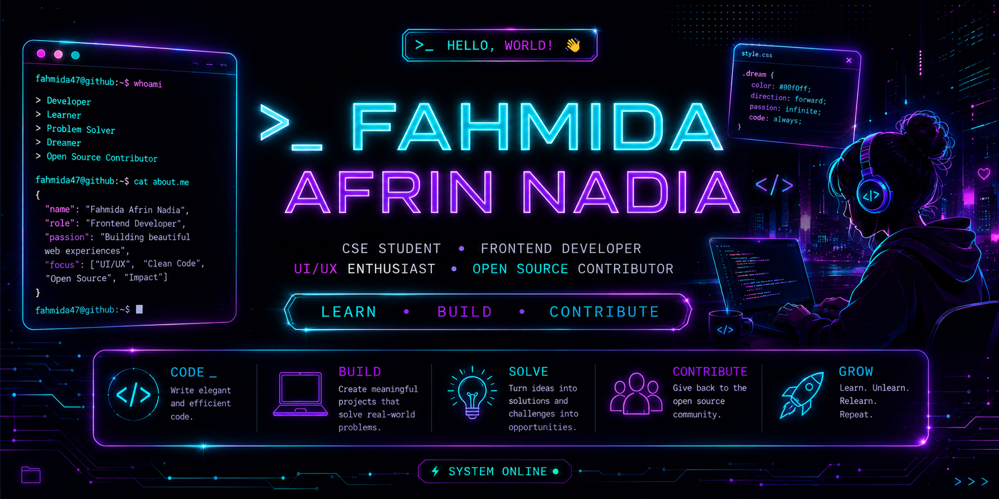

<div align="center">



<br>


</div>

---

## `01` — PROFILE SIGNAL

```text
fahmida47@github:~$ whoami

> CSE Student
> Aspiring Frontend Developer
> UI/UX Enthusiast
> Open Source Contributor

fahmida47@github:~$ current_focus

> JavaScript
> React.js
> Responsive Web Development
> UI/UX
> Open Source Contribution

fahmida47@github:~$ status

[ ONLINE ] — Learning • Building • Contributing
```

---

## `02` — ABOUT ME

I'm a Computer Science & Engineering student passionate about building modern, responsive and user-friendly web experiences.

* 💻 Focused on **Frontend Development**
* 🎨 Interested in **UI/UX & modern interface design**
* 🌱 Currently improving my **JavaScript & React.js** skills
* 🚀 Building real-world academic and personal projects
* 🌍 Exploring **Open Source Development**
* 🔧 Learning to build clean, responsive and accessible interfaces
* 🎯 Preparing myself for a professional software development career

---

## `03` — CURRENTLY BUILDING

<table>
<tr>
<td width="50%" valign="top">

### 🌐 Frontend Development

```text
HTML
CSS
JavaScript
React.js
Vite
```

</td>

<td width="50%" valign="top">

### 🚀 Exploring

```text
Modern UI
Responsive Design
Open Source
Git & GitHub
Component-based Development
```

</td>
</tr>
</table>

---

## `04` — 🛠️ TECH STACK

### 💻 Languages

<div align="center">


&nbsp;&nbsp;

&nbsp;&nbsp;

&nbsp;&nbsp;

&nbsp;&nbsp;

&nbsp;&nbsp;


</div>

### ⚛️ Frameworks & Development

<div align="center">


&nbsp;&nbsp;

&nbsp;&nbsp;


</div>

### 🧰 Tools & Design

<div align="center">


&nbsp;&nbsp;

&nbsp;&nbsp;

&nbsp;&nbsp;

&nbsp;&nbsp;


</div>

---


## `05` — 📊 GITHUB ACTIVITY

<div align="center">


</div>

---

## `06` — 🚀 MY PROJECTS

<table>
<tr>
<td width="50%" valign="top">

### 🌍 TripMesh

https://github.com/fahmida47/TripMesh

**Tourist-as-a-Service Marketplace**

A tourism marketplace designed to connect tourists with local guides and travel experiences.

**Tech Stack**

`React` `Vite` `JavaScript`

</td>

<td width="50%" valign="top">

### 🎓 Agranika

https://github.com/fahmida47/Agranika

**Education Platform**

A web project focused on creating an accessible and user-friendly educational experience.

**Tech Stack**

`HTML` `CSS` `JavaScript`

</td>
</tr>

<tr>
<td width="50%" valign="top">

### 📚 TutorSphere

**Online Tutor Finding & Management System**

A database-focused system for finding and managing tutors and learners.

**Tech Stack**

`PHP` `MySQL` `SQL`

</td>

<td width="50%" valign="top">

### 🐱 The Meow Escape

https://github.com/fahmida47/The-Meow-Escape

**2D Arcade Game**

A 2D arcade game developed using C and iGraphics, featuring multiple levels and interactive gameplay.

**Tech Stack**

`C` `iGraphics`

</td>
</tr>
</table>

---

## `07` — 🌱 OPEN SOURCE CONTRIBUTIONS

### 🎨 EaseMotion CSS — Aurora Theme Crossfade

https://github.com/SAPTARSHI-coder/EaseMotion-css/pull/51979

Contributed a CSS-only dark/light theme crossfade demonstration featuring:

* Smooth theme token transitions
* Glassmorphism UI
* Responsive layout
* Accessibility support with `prefers-reduced-motion`

✅ Successfully merged into the main repository.

---

### 🎨 EaseMotion CSS — Animated Navigation Button

https://github.com/SAPTARSHI-coder/EaseMotion-css/pull/43991

Contributed an animated home navigation button component to an open-source CSS framework.

✅ Successfully merged through a GitHub Pull Request.

---

### 🖼️ Pocket Pixel

https://github.com/ali-ahnaf/pocket_pixel/pull/190

Contributed to an open-source image editing project by improving UI functionality and fixing issues.

✅ Successfully merged through a GitHub Pull Request.

---

## `08` — 📈 GITHUB STATS

<div align="center">


<br><br>


</div>

---

## `09` — ✍️ DEVELOPER QUOTE

<div align="center">


</div>

---

## `10` — 🌐 CONNECT WITH ME

<div align="center">

<a href="https://sites.google.com/view/fahmidaafrinnadia/home">

</a>
&nbsp;&nbsp;&nbsp;&nbsp;&nbsp;

<a href="YOUR_LINKEDIN_LINK">

</a>
&nbsp;&nbsp;&nbsp;&nbsp;&nbsp;

<a href="https://github.com/fahmida47">

</a>
&nbsp;&nbsp;&nbsp;&nbsp;&nbsp;

<a href="https://www.youtube.com/@FahmidaAfrinNadia">

</a>
&nbsp;&nbsp;&nbsp;&nbsp;&nbsp;

<a href="mailto:fahmida.200547@gmail.com">

</a>

<br><br>

<sub>
🌐 Portfolio &nbsp; • &nbsp; 💼 LinkedIn &nbsp; • &nbsp; 🐙 GitHub &nbsp; • &nbsp; ▶️ YouTube &nbsp; • &nbsp; ✉️ Email
</sub>

<br><br>

<sub><i>Let's connect, collaborate and build something meaningful.</i></sub>

</div>

---

<div align="center">

<br>

### ✨ Thanks for visiting my profile!

<sub>Always learning • Always building • Always growing</sub>

</div>
